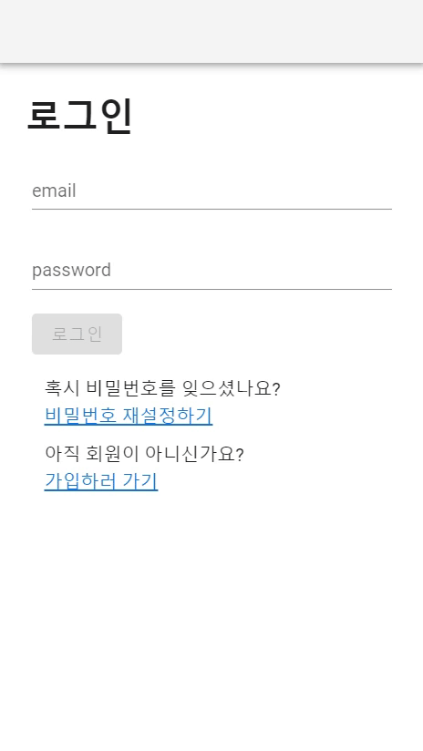
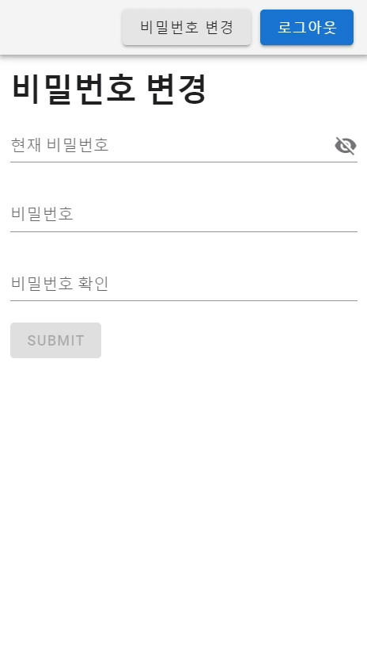
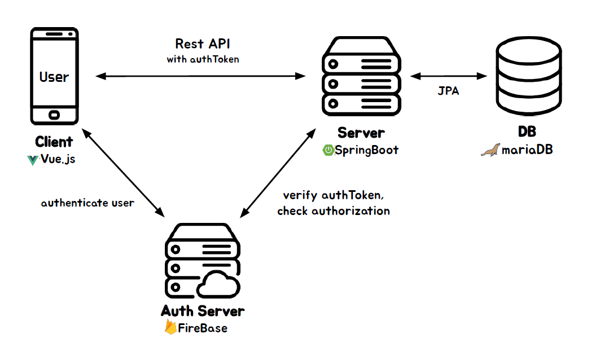

# Sub Project 1

SSAFY 4기 2학기 공통 프로젝트 Sub Project1  

  

## Index
* [Intro](#intro)
* [Architecture](#architecture)
* [Tech Stack](#tech-stack)
* [Feature](#feature)

 

## Intro
Sub Project1의 요구 사항인
회원가입, 로그인, 인증, 인가, 회원정보 수정 구현

   

 

## Architecture

 

## Tech Stack
Back-End
- SpringBoot
- Spring Security
- JPA Hibernate
- MariaDB
- Firebase

Front-End
- Vue.js
- Vuetify
- HMTL
- CSS
- JavaScript

 

## Feature

- 사용자 인증, 인가
    - 인증이 필요한 요청인 경우 Firebase에서 IdToken 유효성 검사 
    - AuthenticationProvider 구현체에서 인증된 사용자의 권한 확인

- 로그인 
    - JWT 토큰 기반
- 회원가입
    - Firebase 메일 인증을 기반으로 함
- 비밀번호 변경
    - Firebase를 통해 사용자 재인증 후 비밀번호 변경
- 비밀번호 찾기
    - Firebase 메일 인증을 기반으로 비밀번호 찾기
- VeeValidate 라이브러리를 통한 사용자 입력 값 유효성 검사
    - 이메일, 패스워드 등의 입력 값 유효성 커스터마이징

To Do:
- 리팩토링(ICP, DIP 최대한 지키기)
- SNS 로그인
- 토큰 저장소 구현