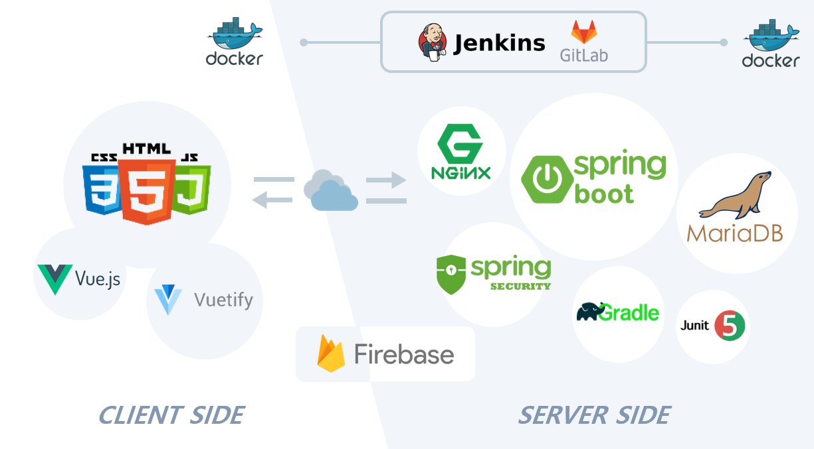

# Viewment

SSAFY 4기 2학기 공통 프로젝트 Sub Project3 

 <br/>


## Index
* [Intro](#intro)
* [Architecture](#architecture)
* [Tech Stack](#tech-stack)
* [User Manual](#user-manual)
* [Feature](#feature)

<br/>


## Intro

- 진행 기간: 2020.01.04 ~ 2020.02.19
- 목표
  - 장소를 통한 추억 공유
- 웹사이트 이름: Viewment
  - 장소를 통한 추억공유 SNS 커뮤니티


<br/><br/>


## Architecture



<br/><br/>


## Tech Stack
Back-End
- SpringBoot
- Spring Security
- JPA Hibernate
- MariaDB
- Firebase

Front-End
- Vue.js
- Vuetify
- HMTL
- CSS
- JavaScript

<br/> <br/>

## User Manual

#### Front End
1. /frontend/firebaseConfig.js 파일 추가
2. 
```
cd ./frontend
npm install
npm run serve
```

#### Back End
1. /backend/src/main/resources/application.yml 파일 추가
2. 
```
cd ./backend
gradlew clean build
java -jar {생성된jar파일이름}
```

<br/> <br/>

## Feature

### 주요 기능

	

#### 회원

- 사용자 인증, 인가
  - 인증이 필요한 요청인 경우 Firebase에서 IdToken 유효성 검사 
  - AuthenticationProvider 구현체에서 인증된 사용자의 권한 확인

- 로그인 
  - JWT 토큰 기반
- 회원가입
  - Firebase 메일 인증을 기반으로 함
- 비밀번호 변경
  - Firebase를 통해 사용자 재인증 후 비밀번호 변경
- 비밀번호 찾기
  - Firebase 메일 인증을 기반으로 비밀번호 찾기
- VeeValidate 라이브러리를 통한 사용자 입력 값 유효성 검사
  - 이메일, 패스워드 등의 입력 값 유효성 커스터마이징


#### 프로필

1. 내 정보 조회
2. 팔로워 및 팔로잉 회원 목록 조회
3. 내가 올린 게시글을 지도, 피드 형태로 조회
4. **기억하기** 한 장소들에 올라온 게시글 조회 


#### 게시글

1. 원하는 장소에 pin을 생성하여 사진 등록 가능
2. 게시글 내용, 해시태그 포함
3. 댓글과 대댓글 등록 가능
4. 날짜/시간 설정 가능
   - 사진 찍은 날짜를 설정하여 과거의 사진도 촬영한 날짜에 맞게 등록 


#### 검색

1. 장소 검색 
   - 지도 API를 통해 원하는 장소로 이동 가능
2. 해시태그 검색
3. 회원 검색
   - 닉네임으로 검색


#### 피드

1. 지도 tab
   - 사진이 등록되어 있는 장소들을 지도 위에 핀으로 표시
   - 현재 위치를 기반으로 조회 가능 
2. 피드 tab
   - 팔로우한 사람들, 기억하고 싶은 장소에 올라온 사진들을 피드 형태로 확인
   - 현재 위치를 기준으로 가까운 곳에 등록된 사진 순으로 조회 가능
3. 모아보기
   - 지도 위의 핀을 클릭하여 해당 장소에 등록된 사진 조회
   - 날짜 필터를 설정하여 원하는 시기의 사진 조회 가능 


#### 기억하기

- 원하는 장소를 기준으로 주변을 **기억하기** 등록
- 해당 위치에 게시글이 올라오면 알람 
- 근방 몇 미터까지 알람을 받아볼 것인지 설정 가능
- 기억하기 장소에 이름을 부여할 수 있음
- 다른 회원들의 프로필에서 기억하기 장소들을 조회 가능 

<br/> <br/>
## 팀원


